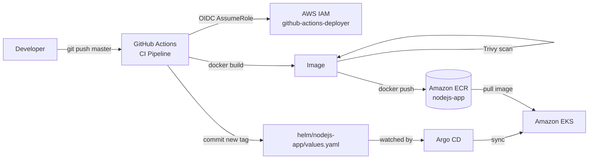

# GitHub Actions Project

[](https://github.com/ajike112/GitHub-Actions-Project/actions/workflows/ci.yml)
[](https://github.com/ajike112/GitHub-Actions-Project/actions/workflows/terraform.yaml)

An end-to-end CI/CD and GitOps pipeline for a Node.js web app. Every push to `master` builds a Docker image, scans it with Trivy, pushes it to Amazon ECR, and bumps the image tag in a Helm chart. Argo CD watches that chart and rolls the new version out to Amazon EKS.

GitHub Actions signs in to AWS with **OIDC**, so no AWS access keys are stored in GitHub. AWS infrastructure is defined in **Terraform**, with remote state in S3 and locking in DynamoDB.

## How it works



1. **Push** to `master` triggers the `CI Pipeline` workflow.
2. The workflow **authenticates to AWS** through GitHub's OIDC provider and assumes the `github-actions-deployer` IAM role.
3. It **builds** the Docker image, tagged with the commit SHA and `latest`.
4. **Trivy** scans the image for vulnerabilities (reports only, doesn't fail the build).
5. The image is **pushed** to the `nodejs-app` ECR repository.
6. The workflow **updates** `image.tag` in `helm/nodejs-app/values.yaml` to the commit SHA and commits it back to `master`.
7. **Argo CD** sees the change and syncs the Helm chart to the EKS cluster (automated sync with prune and self-heal).

## Repository structure

```
.
├── .github/workflows/
│   ├── ci.yml                        # Build, scan, push, bump Helm tag
│   └── terraform.yaml                # Manually triggered Terraform plan/apply
├── nodejs-app/app/                   # Express "Web Bank" demo app
├── Dockerfile                        # Multi-stage build, runs as non-root user
├── helm/nodejs-app/                  # Helm chart (Deployment + LoadBalancer Service)
├── argocd/Node.js-app.yaml           # Argo CD Application pointing at the Helm chart
├── S3-DynamoDB-backend-bootstrap/    # One-time: S3 bucket + DynamoDB table for TF state
└── Infra-bootstrap/                  # OIDC provider, IAM role and policies, ECR repo
    └── EKS/                          # aws-auth ConfigMap mapping the role into EKS
```

## The application

`nodejs-app/app` is a dummy online-banking app built with Express. It serves a static frontend from `public/` and a JSON API under `/api/*` (accounts, transactions, transfers, cards, loans, security, settings, support, tools). It listens on port `3000`.

Run it locally:

```bash
cd nodejs-app/app
npm install
npm start          # or: npm run dev (auto-reload with nodemon)
# open http://localhost:3000
```

Or with Docker:

```bash
docker build -t nodejs-app .
docker run -p 3000:3000 nodejs-app
```

## Workflows

### CI Pipeline — `.github/workflows/ci.yml`

| | |
|---|---|
| **Triggers** | Push to `master`, or manually via *Run workflow* |
| **Permissions** | `id-token: write` (OIDC), `contents: write` (to commit the Helm tag) |
| **Output** | `<account>.dkr.ecr.us-east-1.amazonaws.com/nodejs-app:<commit-sha>` and `:latest` |

The ECR registry address comes from the `amazon-ecr-login` step, so no repository URL secret is needed. The Helm tag commit is pushed with `GITHUB_TOKEN`, which does not start another workflow run, so there's no loop.

### Terraform Infra — `.github/workflows/terraform.yaml`

| | |
|---|---|
| **Triggers** | Manual only (*Actions → Terraform Infra → Run workflow*) |
| **Inputs** | `apply` (checkbox). Unticked runs `plan` only, ticked runs `plan` then `apply` |
| **Working directory** | `Infra-bootstrap/` |

## Infrastructure (Terraform)

### 1. State backend — `S3-DynamoDB-backend-bootstrap/`

Creates the S3 bucket (versioned, encrypted) for remote state and the `tfstate-locks` DynamoDB table for locking. Run it once, from your machine. It keeps local state, which is gitignored.

### 2. Bootstrap — `Infra-bootstrap/`

| File | Creates |
|---|---|
| `github-oidc.tf` | IAM OIDC provider for `token.actions.githubusercontent.com` |
| `github-actions-role.tf` | `github-actions-deployer` role, assumable only from this repo's `master` branch |
| `eks-access-policy.tf` | Policy for EKS access and pushing/pulling images in ECR |
| `terraform-access-policy.tf` | Policy that lets the role run this Terraform (state, lock table, and the resources above) |
| `ecr.tf` | `nodejs-app` ECR repository with scan-on-push |
| `terraform.tfvars` | `github_org` and `github_repo` values |

State is stored at `s3://adekunle-s3-backend-tfstate/infra-bootstrap/terraform.tfstate`.

> **Note:** The EKS cluster itself is not created by this repository. `Infra-bootstrap/EKS/aws-auth-configmap.tf` maps the deployer role into an existing cluster's `aws-auth` ConfigMap.

## Setting it up from scratch

**Prerequisites:** an AWS account, AWS CLI configured with admin credentials, Terraform ≥ 1.5, an EKS cluster with Argo CD installed, and `kubectl` access to it.

1. **Create the state backend** (one time):
   ```bash
   cd S3-DynamoDB-backend-bootstrap
   terraform init && terraform apply
   ```
2. **Create the OIDC provider, IAM role, and ECR repo.** The first apply must run from your machine, because the role can't grant itself permissions before it exists:
   ```bash
   cd Infra-bootstrap
   terraform init && terraform apply
   ```
3. **Add the repository secret** in *Settings → Secrets and variables → Actions*:

   | Secret | Value |
   |---|---|
   | `AWS_GITHUB_ACTIONS_ROLE_ARN` | The `github_actions_role_arn` output from step 2 |

4. **Register the app with Argo CD:**
   ```bash
   kubectl apply -f argocd/Node.js-app.yaml
   ```
5. **Push to `master`.** The CI pipeline builds and pushes the image, and Argo CD deploys it. Get the app's URL from the LoadBalancer service:
   ```bash
   kubectl get svc
   ```

After step 2, later infrastructure changes can be planned and applied from the **Terraform Infra** workflow.

## Security notes

- **No long-lived AWS keys.** GitHub Actions gets short-lived credentials through OIDC.
- **Trust is scoped.** Only workflows on this repository's `master` branch can assume the role.
- **Least privilege.** Policies are limited to the specific bucket key, lock table, IAM resources, and ECR repository this project uses.
- **Non-root container.** The image runs as an unprivileged `appuser`.
- **Image scanning.** Trivy scans in CI, and ECR scans on push.
- **Heads-up:** the deployer role can modify its own IAM policies, so it can run Terraform from GitHub. Anyone with write access to `master` could use that to widen its AWS permissions. If you add collaborators, protect the Terraform workflow with a GitHub environment that requires approval.

## Tech stack

GitHub Actions · Docker · Trivy · Amazon ECR · Terraform · AWS IAM (OIDC) · Amazon S3 · DynamoDB · Helm · Argo CD · Amazon EKS · Node.js / Express
